# Hermi design kit (Phase 1)

The Hermi design kit is the reference that every UI build starts from: real tokens, named component classes, nine standalone screens and a component sheet, all in plain HTML and CSS that a React 19, Tailwind 4 and shadcn app can copy. The look is "Boarding Pass on the map": every trip fact is a ticket, every trip sits on a calm illustrated map, and two travelers' dotted routes (pink, then yellow) tie it together on a warm paper ground. It was chosen on 2026-10-03 from four explored directions. The design canvas is at https://claude.ai/artifact/VeWM3tJksFdPZSa2p7qhCP and is private to the owner; the files in this folder are what builds use.

## Files

| File | What it is |
|---|---|
| [tokens.css](tokens.css) | Every design token, light and dark: colors, fonts, type roles, spacing, radii, elevation, motion. Mirrors [05 section 2](../05-ui-ux-spec.md). |
| [hermi.css](hermi.css) | The component classes (`.h-ticket`, `.h-sheet`, `.h-btn` and the rest). Each block starts with a comment naming the 05 section 4 component and the React component it should become. |
| [components.html](components.html) | The component sheet: token swatches, type scale, spacing, radii, then every component in light and dark side by side, with its class names and when to use it. Preview: [png/components.png](png/components.png). |
| [DESIGN-LANGUAGE.md](DESIGN-LANGUAGE.md) | The rules behind the look, so new screens stay coherent: foundations, phone anatomy, components, motifs, do and don't, and a checklist. |
| [screens/](screens) | Nine standalone mockups at 390 by 844, built with `hermi.css`. Open them in a browser. |
| [png/](png) | A 780 by 1688 render of every screen (and a dark render of Trip overview and Paywall), plus `components.png`. |

## Screens

Each screen is a file in [screens/](screens), numbered in the order below. Add `#dark` to the address to preview dark mode. The 05 section is where its behavior, states, copy and events are specified.

| Screen | 05 section | Preview |
|---|---|---|
| [01-welcome.html](screens/01-welcome.html) | 6.1 Splash and onboarding | 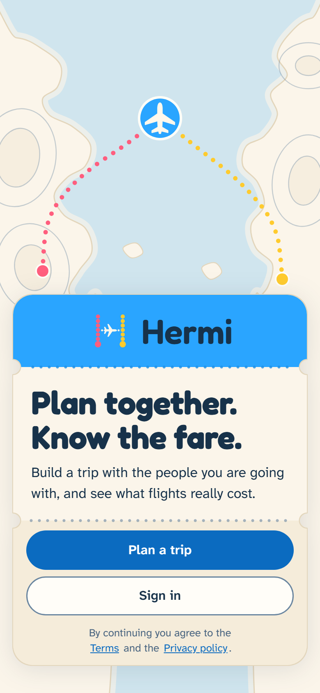 |
| [02-trips-home.html](screens/02-trips-home.html) | 6.5 Trips home, 4.4 Trip card | 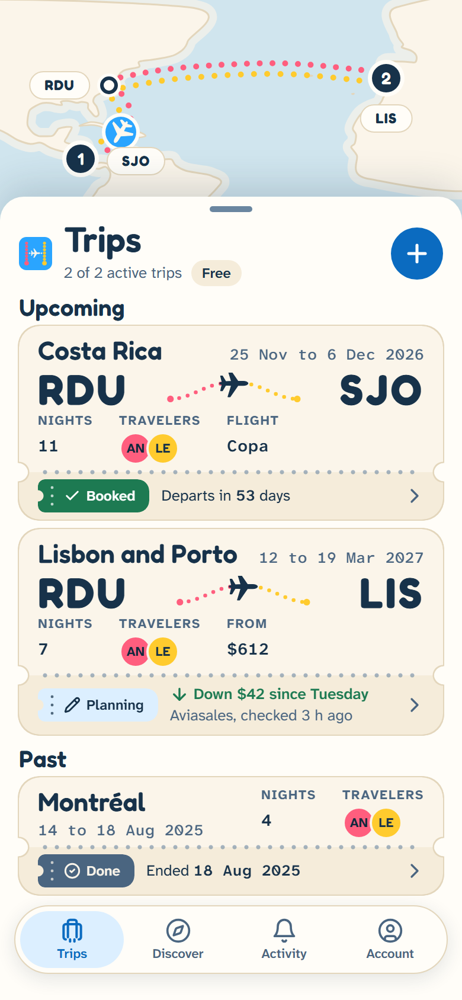 |
| [03-trip-overview.html](screens/03-trip-overview.html) | 6.7 Trip overview | 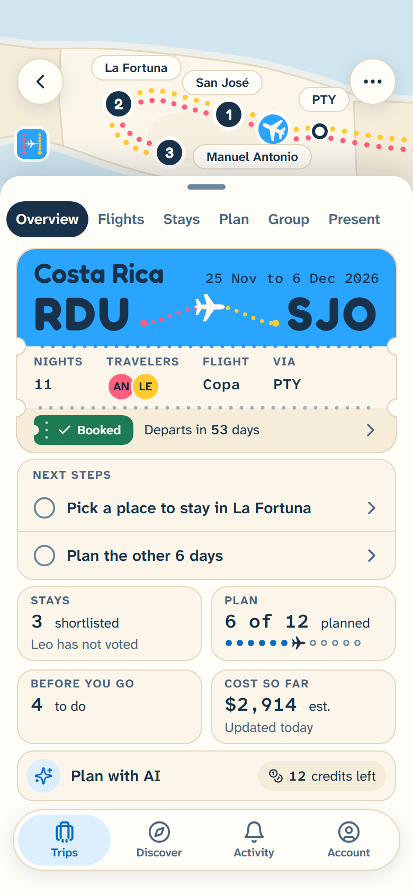 |
| [03-trip-overview.html#dark](screens/03-trip-overview.html#dark) | 6.7 and 12 Dark mode | 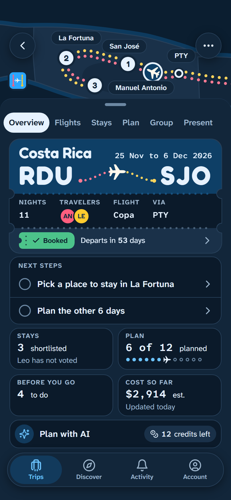 |
| [04-plan-day.html](screens/04-plan-day.html) | 6.12 Plan day view | 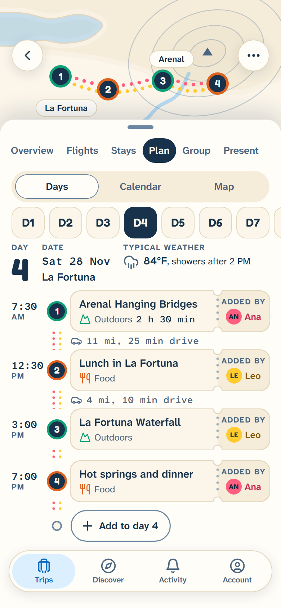 |
| [05-fare-detail.html](screens/05-fare-detail.html) | 6.10 Fare detail | 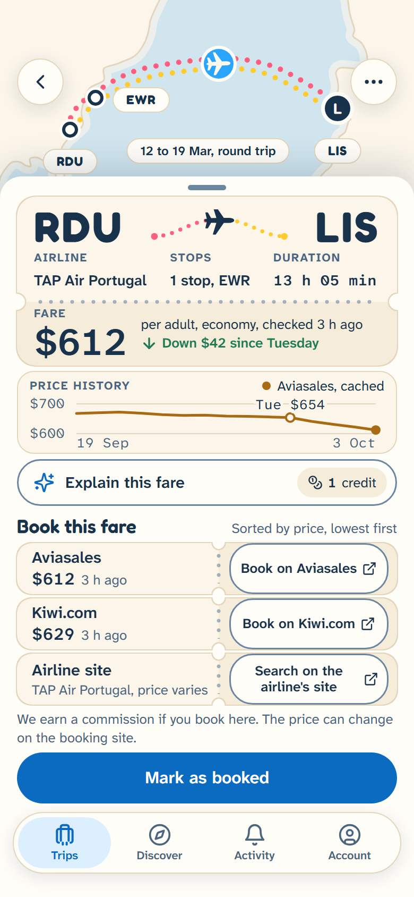 |
| [06-stays-vote.html](screens/06-stays-vote.html) | 6.11 Stays and vote | 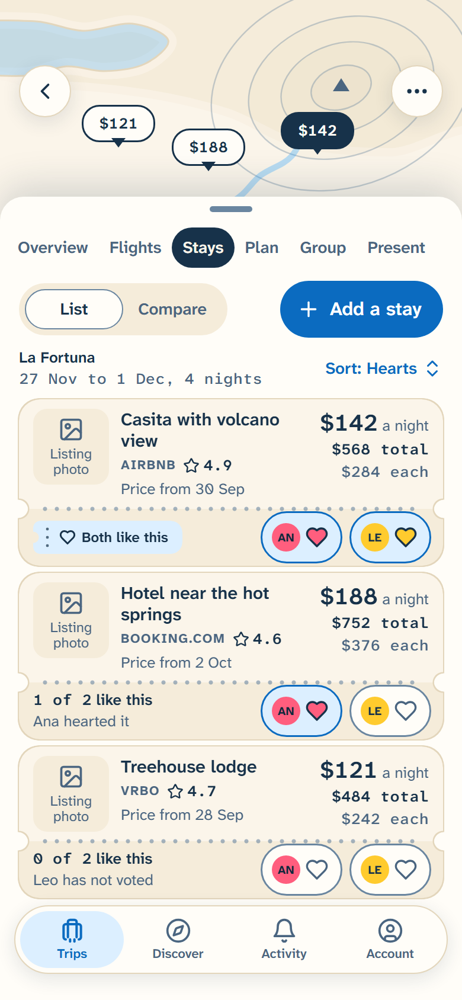 |
| [07-paywall.html](screens/07-paywall.html) | 4.14 Paywall sheet, 6.27 and 8 | 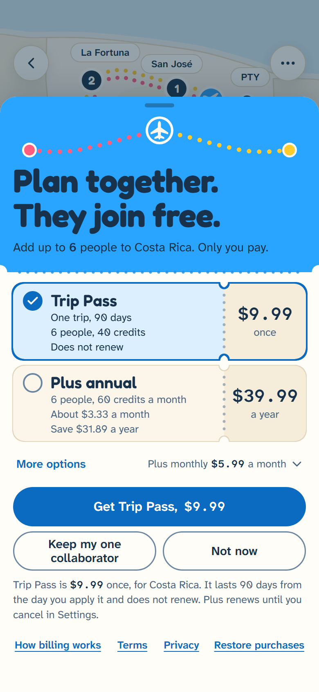 |
| [07-paywall.html#dark](screens/07-paywall.html#dark) | 8 and 12 Dark mode | 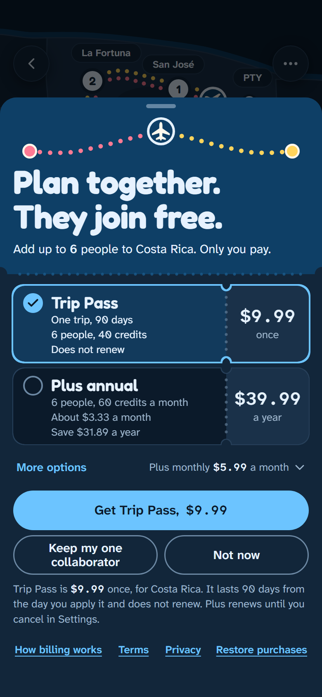 |
| [08-ai-actions.html](screens/08-ai-actions.html) | 6.15 AI actions | 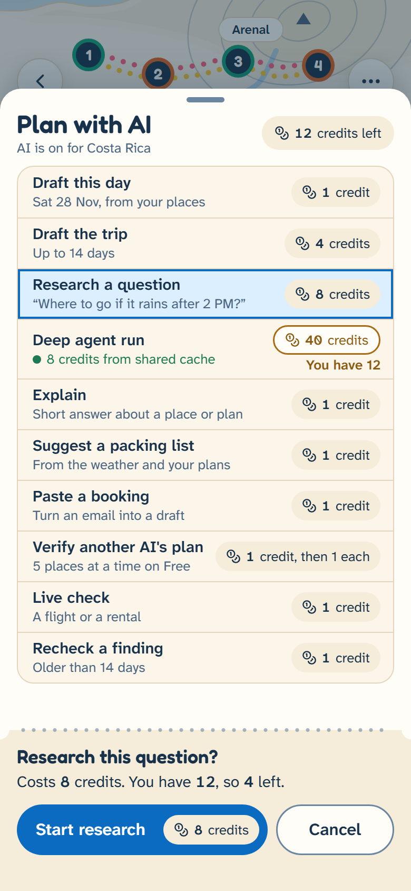 |
| [09-agent-run.html](screens/09-agent-run.html) | 6.16 Agent run | 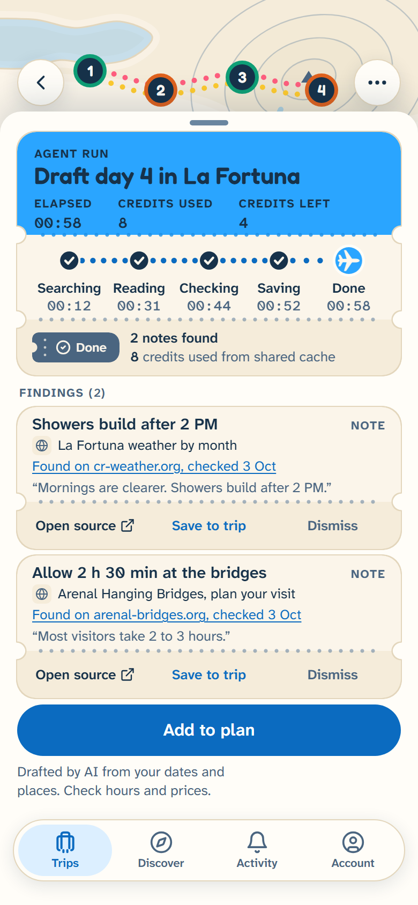 |

## How to use it, for build agents

1. **Port the tokens.** Port `tokens.css` into `packages/tokens` and import `hermi.css` verbatim; the React wrappers emit the `h-` classes. The token names are fixed. The values must equal [05 section 2](../05-ui-ux-spec.md). If they differ, 05 wins and `tokens.css` is wrong. A component block the kit lacks is added to `hermi.css` and `components.html` by the ticket that needs it. The mockups load Google Fonts for convenience; the app bundles the variable fonts and makes no request to Google.
2. **Build each component from its block.** Find the class in `hermi.css`. The comment above the block names the 05 section 4 component and the React component (for example `4.4 Trip card -> <TripTicket>`). Keep the class names or map them one to one to Tailwind utilities; do not change a number.
3. **Match the screen before you build it.** Open the screen's HTML and its PNG in `png/`. The result must look the same at 390 by 844 in light and dark.
4. **A screen with no mockup** follows [DESIGN-LANGUAGE.md](DESIGN-LANGUAGE.md) and its new-screen checklist.
5. **Behavior, states, copy and events come from [05](../05-ui-ux-spec.md).** The mockups show one state of each screen. Loading, empty, error, offline and limit states are in 05 section 6.

## What wins when two sources disagree

- **For the look:** 05 section 2 values first, then this kit, then the ASCII wireframes in 05 section 6.
- **For how a component looks:** `hermi.css` and the mockups win over the prose of 05 sections 4 and 6; the 05 section 2 token values still win over both.
- **For behavior and copy:** 05.

Where the kit differs from 05 on purpose, [DESIGN-LANGUAGE.md](DESIGN-LANGUAGE.md) lists it under "Known gaps".

## Previewing

Open any HTML file in a browser. Add `#dark` to a screen's address (for example `screens/03-trip-overview.html#dark`) to see dark mode. In the app, dark mode is the `dark` class on the root element; with no class the system setting applies, and a `light` class forces light.

Regenerate a PNG with headless Edge (run from any folder; use absolute paths):

```
"C:\Program Files (x86)\Microsoft\Edge\Application\msedge.exe" --headless=new --disable-gpu --hide-scrollbars --blink-settings=preferredColorScheme=1 --force-device-scale-factor=2 --virtual-time-budget=5000 --screenshot=C:\path\to\design\png\03-trip-overview.png --window-size=390,844 file:///C:/path/to/design/screens/03-trip-overview.html
```

- `--blink-settings=preferredColorScheme=1` forces light. Without it, headless Edge follows the Windows setting and may render a light page dark.
- For a dark render, end the address with `#dark` and keep the flag.
- `--virtual-time-budget=5000` waits for the web fonts and lets the run animation finish.
- `components.png` uses `--force-device-scale-factor=1`, `--window-size=1120,<page height>` (about 23,000 px) and `file:///C:/path/to/design/components.html`.

## Changing the design

1. Change [05 section 2](../05-ui-ux-spec.md) and `tokens.css` together. A token value must never differ between them.
2. Keep [BRAND.md](../../brand/BRAND.md) in step if a brand color or type role changes.
3. Update the affected block in `hermi.css`, the screens and `components.html`, then re-render the PNGs.
4. If the owner wants it on the canvas, update the mockup there too. The canvas is a copy; this folder is the source.
